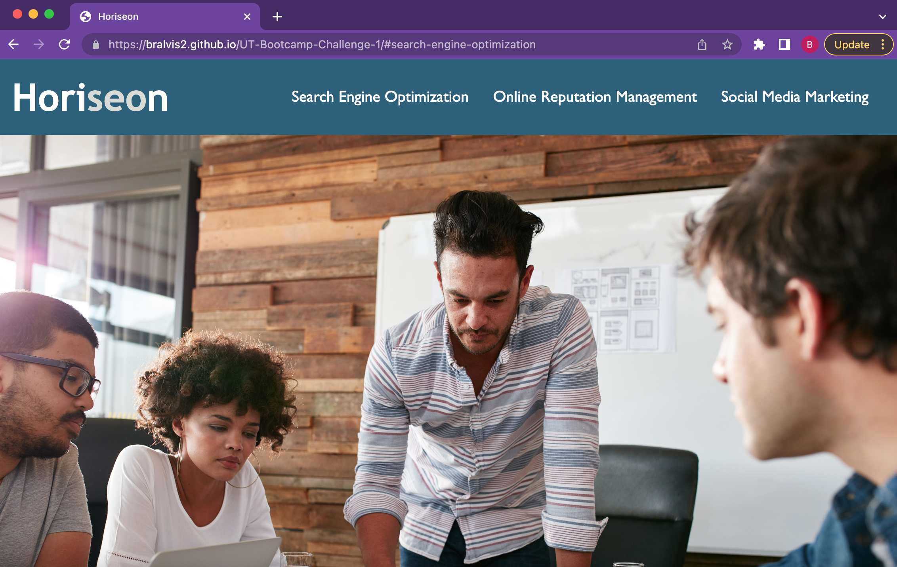
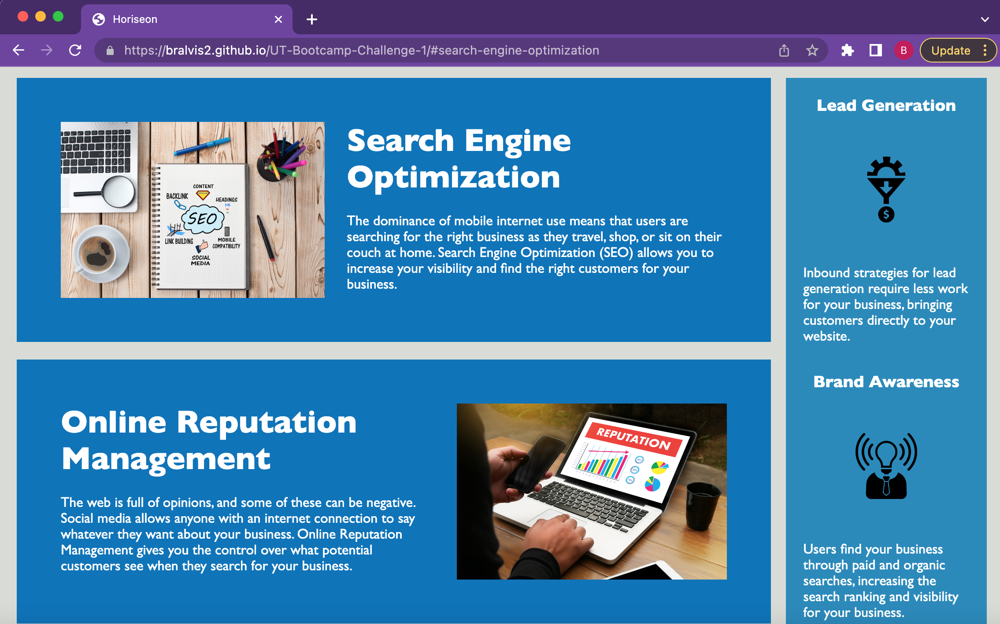

# UT-Bootcamp-Challenge-1
## Challenge Overview
In this week's challenge, our task was to use the starter code and modify it to meet certain criteria. The main purpose of this task was to refactor a code to improve its accessibility while maintaining its aesthetic elements. Making conscientious decisions about accessibility while writing code is important to ensure everyone has equal access to websites. Additionally, keeping in mind the **Scout Rule**, and leaving the code better than you found it. 

## Criteria 
This is the Criteria that I used to guide my as I made edits to the code. 
1. An up to date codebase that follows accessibility standards so the site is optimized for search engines. 
2. Semantic HTML elements
3. HTML elements follow a logical structure independent of styling and positioning. 
4. Accessible alt attributes
5. Heading attributes fall in sequential order
6. Descriptive element titles

## What I Changed and Why. 
I began this assignment by exploring the website and getting an idea of elements that worked and which elements didn't. I noticed that the search engine optimization link did not function while the other two links did. Then I explored the html file to familiarize myself with the structure. The main thing that stood out were the div tags. I also took some time to find out the difference between the links and why one might not be working. After I found the missing id, I looked at my CSS file. Once that was corrected, I began to make changes to the tags in the html file. I checked my progress after making small changes. Additionally, I made changes in the CSS file alongside the changes in the html. Lastly, I cleaned up redundant commands.

## URL of Deployed Application
https://bralvis2.github.io/UT-Bootcamp-Challenge-1/#search-engine-optimization

## Screenshot of Deployed Application

